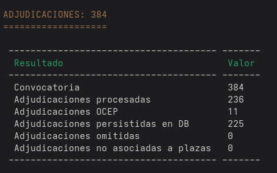

# SIPRI Analyzer


[]

## Getting Started

1. If not already done, [install Docker Compose](https://docs.docker.com/compose/install/) (v2.10+)
2. Run `docker compose build --pull --no-cache` to build fresh images
3. Run `docker compose up --wait` to set up and start a fresh Symfony project
4. Open `https://localhost` in your favorite web browser
   and [accept the auto-generated TLS certificate](https://stackoverflow.com/a/15076602/1352334)
5. Run `docker compose down --remove-orphans` to stop the Docker containers.

## Join the container

```bash
docker compose exec -it sipri bash
```

## Usage

### Install dependencies and first run

```bash
# Consider running this command inside the container:
bin/console composer install
bin/console doctrine:database:create --if-not-exists
bin/console doctrine:migrations:migrate --no-interaction
```

### Basic commands

#### GET: To get required PDFs from the SIPRI website

```bash
bin/console sipri:get 2

#use --force to force download even if the file already exists
bin/console sipri:get --force 2
```

#### EXT: To extract positions from the PDFs

```bash
bin/console sipri:ext 2

# use --info to get information about the extracted data 
bin/console sipri:ext --info
```


#### ADJ: To link adjudications to the extracted positions

```bash
bin/console sipri:adj 2

# use --info to get information about the extracted data 
bin/console sipri:adj --info
```



#### DEL: Remove convocatorias and all related adjudications

```bash
bin/console sipri:del 2
```

#### Remove only adjudications

```bash
bin/console sipri:del --adjudicaciones 2
bin/console sipri:del --adj 2
```


#### Remove convocatorias and all related adjudications and files

```bash
bin/console sipri:del --files 2
```

#### Get, extract and process adjudications, in a loop

```bash
# use desired range {1..10} to get the affected convocatorias
for i in {1..10}; do 
    php bin/console sipri:get "$i"; 
    php bin/console sipri:ex "$i"; 
    php bin/console sipri:adj "$i";
    sleep 5; # to avoid overloading the server
done
```

#### Generar static website

```bash
cp var/data_dev.db var/data_prod.db # copy dev database to prod
bin/console -e prod cache:clear
bin/console -e prod stenope:build --host=acardielf.github.io --base-url=/sipri_analyzer --scheme=https --no-sitemap ./docs
```   

### Debugging

If you need to debug the application, you can use the following command to start a Symfony server with Xdebug enabled:

```bash
XDEBUG_SESSION=1 PHP_IDE_CONFIG="serverName=symfony" php bin/console <your-command>
```

### Localizar convocatorias con orden desordenado

```bash
find . -type f -name "*_adjudicados.pdf" -exec pdftotext {} {}.txt \;
find . -type f -name "*_adjudicados.pdf.txt" -print0 | xargs -0 grep -L "ANEXO II" > ausentes.txt

# borrar los ficheros
find . -type f -name "*_adjudicados.pdf.txt" -exec rm {} \;
```

## Credits

Created by Ángel Cardiel, based on dunglas/symfony-docker template.
Created by [Kévin Dunglas](https://dunglas.dev), co-maintained by [Maxime Helias](https://twitter.com/maxhelias) and
sponsored by [Les-Tilleuls.coop](https://les-tilleuls.coop).

